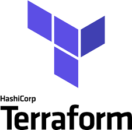

### Hi there, I'm Flora 👋 

## I'm a Human Being, Foodie and Developer!!

- 🌱 I’m constantly learning everything 🤣
- 🥅 2022 Goals: Contribute more to Open Source projects
- ⚡ Fun fact: I love to play video games 🎮 and work out 💪

### Connect with me:
[][linkedin]
[][instagram]
[][tiktok]
 

### Languages and Tools:

[][linkedin]
[][linkedin]
[][linkedin]
[][linkedin]
[][linkedin]
[][linkedin]
[][linkedin]
[][linkedin]
[][linkedin]
[][linkedin]
[][linkedin]
[][linkedin]
 
 

### Github Status:

  
:zap: Recent GitHub Activity

  
<!--START_SECTION:activity-->
👩‍💻 Working on cracking puzzles from [Advert of Code 2021](https://adventofcode.com/2021)

🎄 Celebrating christmas
<!--END_SECTION:activity-->

  
:zap: GitHub Stats

  

[instagram]: https://instagram.com/_floraqin
[linkedin]: https://www.linkedin.com/in/weimeng-qin-98a805175/
[tiktok]: https://www.tiktok.com/@floraqin_qvq
